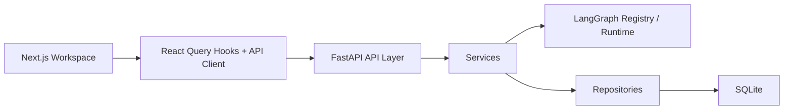

# Jeeves

一个可扩展的全栈 LangGraph AI 助手项目：

- `backend/`: `FastAPI + LangGraph + SQLite`
- `frontend/`: `Next.js 15 + React 19 + TanStack Query`
- OpenAPI 驱动的前后端类型契约
- SSE 流式聊天、图配置、模型配置、历史对话与运行状态面板

## 架构概览

当前代码已经按 `api / services / repositories / graphs` 分层：

- `api`: 定义 HTTP 协议、状态码、请求与响应模型。
- `services`: 编排聊天、SSE、标题生成、缓存与业务逻辑。
- `repositories`: 处理 SQLite 访问与持久化。
- `graphs`: 注册 LangGraph 拓扑、默认 prompt 和编译缓存。



## 目录结构

```text
.
├── backend
│   ├── app
│   │   ├── api/
│   │   ├── graphs/
│   │   ├── repositories/
│   │   ├── services/
│   │   ├── config.py
│   │   ├── database.py
│   │   ├── graph.py
│   │   ├── llm.py
│   │   ├── main.py
│   │   ├── messages.py
│   │   ├── schemas.py
│   │   └── telemetry.py
│   ├── scripts/export_openapi.py
│   ├── tests/
│   └── pyproject.toml
├── frontend
│   ├── app/
│   ├── components/
│   │   ├── providers/
│   │   ├── settings/
│   │   ├── assistant-workspace.tsx
│   │   ├── chat-pane.tsx
│   │   └── conversation-sidebar.tsx
│   ├── hooks/
│   ├── lib/
│   │   ├── api/
│   │   ├── api.ts
│   │   └── utils.ts
│   ├── scripts/generate-api.mjs
│   └── package.json
└── .github/workflows/ci.yml
```

## 数据模型

SQLite 当前维护 4 张核心表：

- `llm_configs`: 模型名称、API Key、Base URL、温度、重试次数、激活状态。
- `graph_configs`: 图类型、系统 prompt、分析 prompt、拆解 prompt、激活状态。
- `conversations`: 会话标题、创建时间、更新时间。
- `conversation_messages`: 角色、内容、所属会话、创建时间。

已建立的索引：

- `conversation_messages(conversation_id)`
- `conversations(updated_at DESC)`
- `llm_configs(is_active, updated_at DESC)`
- `graph_configs(is_active, updated_at DESC)`

## API 契约

核心接口如下：

- `GET /api/health`: 返回当前运行状态与已激活模型信息。
- `GET /api/llm-configs`: 查询模型配置列表。
- `POST /api/llm-configs`: 创建模型配置。
- `PUT /api/llm-configs/{config_id}`: 更新模型配置。
- `POST /api/llm-configs/{config_id}/activate`: 激活模型配置。
- `POST /api/llm-configs/test`: 测试模型连接。
- `GET /api/graph-configs`: 查询工作流配置列表。
- `POST /api/graph-configs/{config_id}/activate`: 激活工作流配置。
- `GET /api/conversations`: 查询历史对话。
- `GET /api/conversations/{conversation_id}`: 获取单个会话详情。
- `POST /api/chat/stream`: SSE 流式聊天。
- `POST /api/chat`: 非流式聊天接口。

前端类型不再手写：

- FastAPI 通过 `openapi.json` 暴露契约。
- `frontend/scripts/generate-api.mjs` 调用 `openapi-typescript` 生成 `frontend/lib/api/generated.ts`。
- `frontend/lib/api/client.ts` 作为统一 API client，供 hooks 使用。

## 内置工作流

当前内置 3 种图类型：

- `simple_chat`: 单节点对话，适合普通问答。
- `summary_analysis`: 两阶段分析流，先分类/分析，再输出结构化拆解。
- `viral_tweet`: 两阶段爆款推文流，先提炼传播主轴，再生成主推文、备选版本与配套建议。

工作流支持多配置并存：

- 设置页中的“默认工作流”只影响新建对话。
- 每个对话都可以单独绑定自己的工作流，互不影响。

`viral_tweet` 适合这样的输入：

- 只有一个模糊 idea，没有任何资料。
- 有零散资料、案例、事实、草稿，希望系统帮你提炼传播角度。
- 已经知道主题，但想把表达改写成更容易转发、收藏、评论的推文。

## 流式聊天链路

1. 前端发送 `POST /api/chat/stream`。
2. 后端先写入用户消息，再发出 `user_message` SSE 事件。
3. LangGraph 节点输出按 `chunk` 事件逐段返回。
4. 完成后后端写入最终 assistant 消息，并通过 `done` 事件返回最终消息数组。
5. 前端只消费持久化后的 `user_message` 和 `done`，不再制造临时 `temp/synced` 消息 ID。
6. 前后端都支持取消：
   - 前端用 `AbortController`
   - 后端在流式过程中检测 `request.is_disconnected()`

## 配置说明

### 后端环境变量

参考 `backend/.env.example`：

- `OPENAI_API_KEY`
- `OPENAI_MODEL`
- `OPENAI_TEMPERATURE`
- `OPENAI_MAX_RETRIES`
- `OPENAI_BASE_URL`
- `CORS_ORIGINS`
- `DATABASE_PATH`

### 前端环境变量

参考 `frontend/.env.example`：

- `NEXT_PUBLIC_API_URL`
- `BACKEND_URL`

## 本地开发

### 启动后端

```bash
cd backend
cp .env.example .env
env UV_CACHE_DIR=/tmp/uv-cache uv sync --group dev
uv run uvicorn app.main:app --reload --port 8000
```

### 启动前端

```bash
cd frontend
cp .env.example .env.local
npm install
npm run dev
```

### 手机访问

手机和电脑连到同一个局域网后，可以启动移动端入口：

```bash
cd frontend
npm run dev:phone
```

然后在手机浏览器访问 `http://电脑局域网 IP:3000/mobile`。例如电脑 IP 是 `192.168.1.23`，手机访问：

```text
http://192.168.1.23:3000/mobile
```

移动端入口支持添加到手机主屏幕。前端会优先使用同源 `/api` 访问后端，并由 Next.js 代理到 `BACKEND_URL`，因此手机不会把 API 请求打到手机自己的 `localhost`。本地默认 `BACKEND_URL=http://localhost:8000`，后端仍按原方式启动即可。

## 检查与测试

### 后端

```bash
cd backend
env UV_CACHE_DIR=/tmp/uv-cache uv run ruff format --check .
env UV_CACHE_DIR=/tmp/uv-cache uv run ruff check .
env UV_CACHE_DIR=/tmp/uv-cache uv run pytest
```

### 前端

```bash
cd frontend
npm run check
npm run build
```

## 可观测性

后端已经增加结构化日志，覆盖：

- HTTP 请求 ID、状态码和耗时
- LLM 重试事件
- 图执行开始/完成
- SSE 完成、超时和断连
- 模型配置、图配置、标题生成等审计日志

## 部署说明

推荐最小部署方式：

1. 后端使用 `uvicorn` 或容器部署 FastAPI。
2. 前端使用 Vercel、Node 服务器或容器部署 Next.js。
3. 单机原型可继续使用 SQLite。
4. 如果进入多人或生产环境，建议迁移到 PostgreSQL，并把 LLM Key 改为安全存储方案。

如果你要把项目部署到一台自己的 VM，并用 GitHub Actions 直接发布，可以直接参考：

- [`deploy/README.md`](deploy/README.md)
- [`deploy/deploy.sh`](deploy/deploy.sh)
- [`deploy/docker-compose.yml`](deploy/docker-compose.yml)
- [`deploy/docker/nginx.conf`](deploy/docker/nginx.conf)
- [`backend/Dockerfile`](backend/Dockerfile)
- [`frontend/Dockerfile`](frontend/Dockerfile)
- [`.github/workflows/deploy.yml`](.github/workflows/deploy.yml)

## CI

GitHub Actions 已覆盖：

- 后端 `uv sync --group dev`
- `ruff format --check`
- `ruff check`
- `pytest`
- 前端 `npm ci`
- `npm run check`
- `npm run build`
